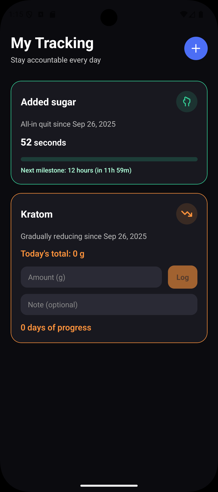

# LessByLess - habit quiting

I made this app mostly for myself to follow some of my requirements. Privacy— data, logs, or anything never leaves your device. Simplicity—easy to use, no unnecessary features or complexity. But if you have some useful feature in mind, let me know via suggesting it on GitHub or fork it and add it yourself.

Also, taking some supplements is often just as a part of a routine, so I wanted to track notes as well when the dosage lowering tracker, so you can track why you took each dose—before gym, before studying, before some task, etc.

Built with Expo Router, React Native, and local persistence (AsyncStorage). Runs on Android but potentially iOS as well.

## Features

- Add trackers for Cold Turkey or Dosage Lowering
- Cold Turkey milestones with live time breakdown and progress bar
- Dosage logging with mg/g units, daily totals, and recent timeline
- Offline-first: data stored locally with AsyncStorage

## Screenshots

Place your screenshots in `docs/screenshots/` and they will render here once committed.

- Home (empty state)
  
- Home (with trackers)
  
- Create Tracker modal
  
  
- Cold Turkey detail
  
- Dosage Lowering detail
  
  

## Quick Start

Prerequisites
- Node 18+ and npm 9+
- iOS: Xcode + Simulator (macOS)
- Android: Android Studio + emulator

Install and run
- `npm install`
- `npm start` – launches the Expo dev server
  - Press `a` for Android, `i` for iOS, or `w` for Web

Convenience scripts
- `npm run android`
- `npm run ios`
- `npm run web`

## Project Structure

- `app/` – Expo Router routes (home, tracker detail, layout)
- `components/` – UI components (tracker cards, detail views, themed primitives)
- `contexts/` – `TrackedItemsProvider` with AsyncStorage persistence
- `hooks/` – utilities like live elapsed time breakdown
- `utils/` – date/time and tracker logic (milestones, totals)
- `constants/` – tracker types, milestone definitions, storage keys
- `types/` and `enums/` – TypeScript models for tracked items
- `assets/` – icons, fonts, splash

## Contributing

- Open an issue or PR with a focused change
- Keep styles consistent with existing components
- Avoid introducing new libraries unless needed
